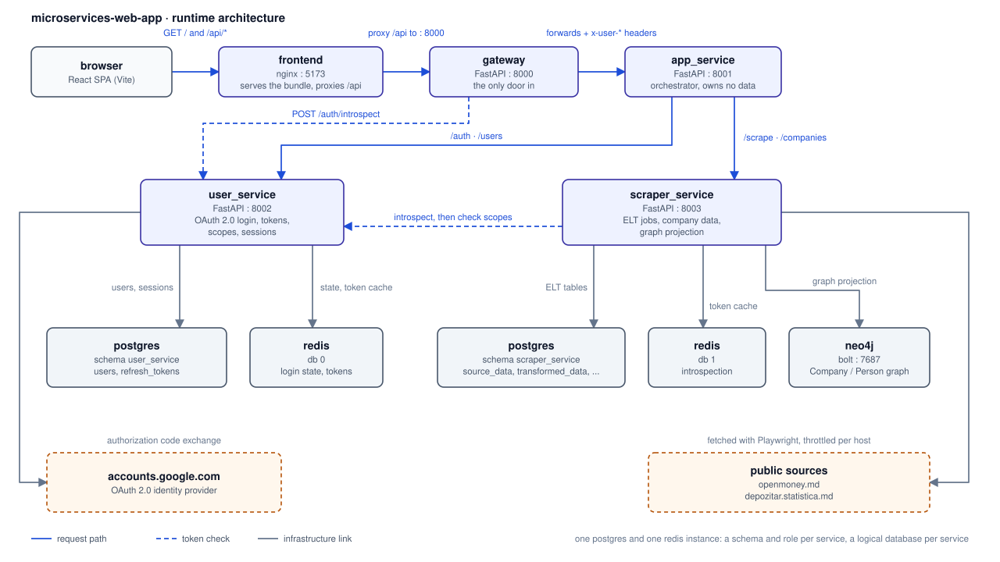
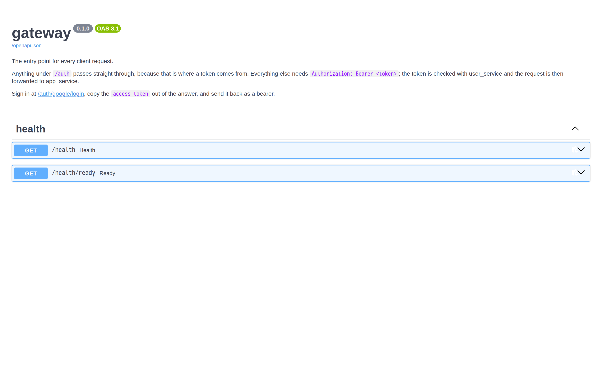
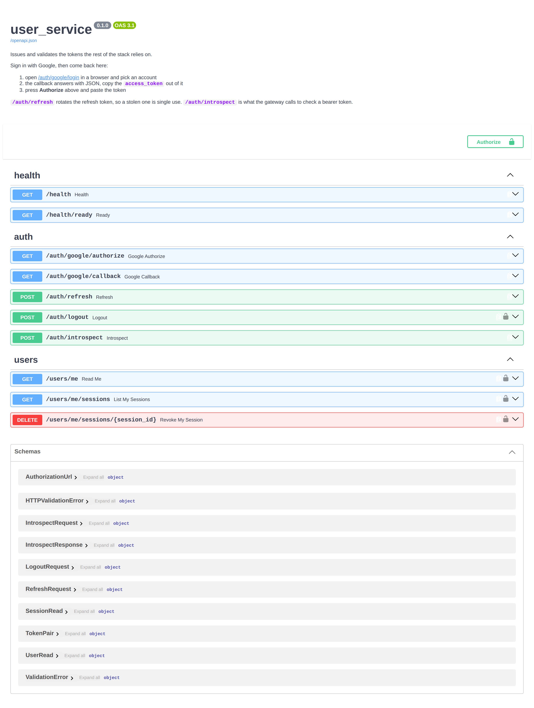
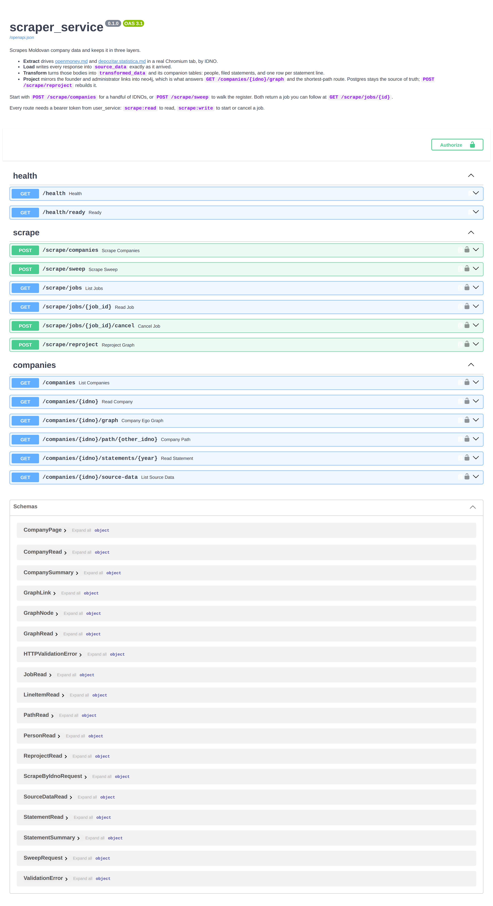

# microservices-web-app

A Fullstack application built with FastAPI microservices and a React frontend. It scrapes the Moldovan company register by IDNO, stores the raw responses and the cleaned rows separately, and serves the result behind one authenticated entry point.

Data comes from [openmoney.md](https://openmoney.md) and from the statistics depository at [depozitar.statistica.md](https://depozitar.statistica.md/). PostgreSQL stores the raw and the transformed data, Redis handles caching and short-lived auth state, and Neo4j holds a graph projection used by the ownership view in the frontend.

[Services](#service-overview) · [Architecture](#architecture) · [Setup](#setup-instructions) · [Auth](#authentication-flow) · [Scraping](#scraping-process) · [ELT](#elt-process) · [Requests](#example-requests) · [Tests](#tests) · [AWS](#development-flow-for-a-deployment-from-aws) · [Deployment](#deployment-strategy) · [TODO](#todo-and-ideas)

## Service overview

Four services, each with its own Dockerfile, `requirements.txt` and tests. Only the gateway and the frontend are reachable from outside the compose network.

**gateway**, port 8000. The entry point for every client request. It checks the bearer token with `user_service`, then forwards to `app_service` with the caller added as `x-user-id`, `x-user-email`, `x-user-role` and `x-user-scopes`. Those headers are removed from the incoming request first, so a client cannot send its own. The gateway does not decode tokens, it asks `user_service`, so the signing key stays in one place and a revoked session stops working here too. Paths under `/auth`, `/health` and the docs pass through without a token.

**app_service**, port 8001. The orchestrator, and the only service the gateway talks to. It forwards each request to the service that owns the path: `/auth` and `/users` to `user_service`, `/scrape` and `/companies` to `scraper_service`. First matching prefix wins, unmatched paths return 404. No database and no cache, so it is easy to scale.

**user_service**, port 8002. Registration, authentication and sessions. Users sign in with Google, so there are no passwords. Access tokens are JWTs signed with HS256, valid 15 minutes, carrying the subject and the granted scopes. Refresh tokens are random strings, stored only as a SHA-256 hash, valid 14 days and rotated on every use. Users can list their active sessions and revoke any of them.

**scraper_service**, port 8003. The scraper, the ELT pipeline and the read API over the result. Scraping runs as a background job and the call returns a job id right away. Two modes: a list of IDNOs, or a sweep that walks the register page by page and resumes from its cursor after a restart. Both sites are scraped through Chromium under Playwright, because the company pages are Angular apps that render in the browser.

## Architecture



PostgreSQL is the source of truth. The two services that own data get their own role and schema, created by `db/init/01_init_schemas.sh`, so neither can read the other's tables. Redis stores the OAuth state between the authorize call and the callback, the denylist of revoked access tokens, and the introspection cache. Neo4j holds the ownership graph, rewritten after every transform. Leave `NEO4J_PASSWORD` empty and the graph endpoint falls back to a one-hop SQL query.

Each service serves Swagger at `/docs`, with screenshots in [`docs/screenshots`](docs/screenshots). The gateway and `app_service` only document their health routes, since everything else they serve is a catch-all proxy.





## Setup instructions

Needs Docker and Docker Compose, plus a Google OAuth 2.0 client for sign-in. Python 3.11 or newer only if you want to run a service outside Docker.

Copy `.env.example` to `.env`. Three values need real content: generate the signing key, then paste the Google credentials from the Cloud Console and add `http://localhost:8002/auth/google/callback` as an authorized redirect URI. Every password in the file is a placeholder, so change them. The frontend has its own `frontend/.env.example`.

```bash
cp .env.example .env
JWT_SECRET_KEY=$(openssl rand -hex 32)   # paste into .env
docker compose up -d --build
```

The first start takes a few minutes, since the scraper image ships Chromium and Postgres runs the schema bootstrap. After that the frontend is on 5173, the gateway on 8000, `app_service` on 8001, `user_service` on 8002, `scraper_service` on 8003, and the Neo4j browser on 7474. Check the chain with `curl http://localhost:8000/health/ready`:

```json
{ "status": "ready", "app_service": "ok", "user_service": "ok" }
```

`docker compose down` stops and keeps the data, `docker compose down -v` drops the volumes too.

For development the compose file mounts each service's `app` directory and runs uvicorn with `--reload`, so editing a file restarts only that service. To run one on the host instead, or to run the frontend on Vite, which proxies `/api` to the gateway:

```bash
cd backend/user_service && pip install -r requirements.txt
uvicorn app.main:app --reload --port 8002

cd frontend && npm install && npm run dev
```

## Authentication flow

OAuth 2.0 authorization code flow with PKCE against Google. The tokens the app uses afterwards are its own.

**1. Start.** The client calls `GET /auth/google/authorize`. The service generates a one-time secret and sends Google only its SHA-256 hash, keeping the secret itself. It also generates a random state value that ties this redirect to the callback that comes back later. The secret is stored in Redis under that state for 10 minutes, and the Google sign-in URL is returned.

**2. Callback.** Google redirects to `/auth/google/callback` with an authorization code and the state. The state is used once to look up the secret. The code and the secret go back to Google, which checks the secret against the hash from step 1 before handing over the ID token. That check is what makes a stolen code useless on its own. The ID token is then verified against Google's public keys, and the user is created or matched.

**3. Tokens.** The service issues its own pair. A browser gets it as two httpOnly cookies and is redirected to a clean URL, so the tokens never reach script, browser history or a referer header. Callers that are not browsers get the pair in the body instead and use the header.

```json
{
  "access_token": "eyJhbGciOiJIUzI1NiIs...",
  "refresh_token": "u1I8ap0olQ-zGjpRhAjK...",
  "token_type": "bearer",
  "expires_in": 900,
  "scope": "users:read scrape:read scrape:write"
}
```

**4. Use.** The browser sends its cookie automatically; anything else sends `Authorization: Bearer <access_token>`. The gateway accepts either, checks it, and rewrites it as a bearer header on the way in, so no service behind the gateway knows cookies exist. There are three scopes and the services check those rather than roles: `users:read` for your own profile and sessions, `scrape:read` for reading company data, `scrape:write` for starting and cancelling jobs.

`POST /auth/refresh` swaps a refresh token for a new pair and marks the old one as replaced, so a reused token is rejected. `POST /auth/logout` revokes it and adds the access token to the Redis denylist until it expires. Both read the token from the body or from the cookie, whichever is there.

## Scraping process

**1. A job is created.** `POST /scrape/companies` takes a list of IDNOs, `POST /scrape/sweep` walks the register instead. Both return 202 with the job row and keep working in the background.

```json
{ "idnos": ["1002600009035", "1004600024841"], "include_depozitar": true }
```

**2. Chromium fetches the pages.** Both sites render in the browser, so a tab loads the page and the data is read from the same API the page calls. A shared throttle keeps at least one second between two requests to the same host. The depository returns 403 if you go faster.

**3. Each company is scraped in turn.** From openmoney: the rendered profile page, the company record and the yearly financial data. From the depository: the list of declarations filed under that IDNO, then each declaration. Only the lookup by fiscal code is used, since the paginated search is behind a reCAPTCHA.

**4. Progress is saved as it goes.** The job row tracks companies done against total, requests succeeded and failed, and rows loaded. A sweep writes its page cursor, so a restart resumes instead of starting over. Statuses 408, 425, 429 and 5xx are retried; anything else counts as a failed request and the job moves on, so one bad company does not stop a sweep.

## ELT process

Extract, Load and Transform are three separate steps, and the raw bodies are kept between the second and the third. That means the transform can be rewritten and re-run without scraping again.

**Extract.** `app/sources.py` holds the browser pool, the throttle and the two site adapters. A fetch returns the URL, the HTTP status, the content type and the body as it arrived. Nothing is parsed here. Set `SCRAPER_CAPTURE_RENDERED_HTML=false` to keep only the JSON responses, which makes a crawl faster and much smaller.

**Load.** Every response goes into `source_data` as it is, with its request URL, status, content type and a SHA-256 of the body. The unique constraint covers source, resource, resource key and body hash together, so re-scraping an unchanged company updates `last_seen_at` instead of writing a duplicate. A changed body becomes a new row and the old one stays. Nothing reads this table except `GET /companies/{idno}/source-data`, which is there so you can check where a value came from.

**Transform.** `app/transform.py` takes those bodies and returns typed rows, with no database and no network, which is why most of the tests live here. Numbers arrive as integers, or as strings like `1 234,56`, or in parentheses meaning negative. The financial statements arrive as flat keys named after the form code and row, and have to be rebuilt into one statement per year with its line items. The result goes into `transformed_data`, one row per company merged from both sources, plus `company_people`, `financial_statements` and `financial_line_items`. Each company records which sources it came from.

The company's nodes and relationships are then written to Neo4j. That is what lets `GET /companies/{idno}/graph` go deeper than one hop, and what `GET /companies/{idno}/path/{other}` uses to connect two companies through the people behind them. `POST /scrape/reproject` rebuilds the graph from `transformed_data`.

## Example requests

Everything goes through the gateway on port 8000. To get a token, open `http://localhost:8000/auth/google/login` in a browser and copy `access_token` from the response.

```bash
TOKEN="paste the access_token here"

curl -H "Authorization: Bearer $TOKEN" http://localhost:8000/users/me

curl -X POST http://localhost:8000/scrape/companies \
  -H "Authorization: Bearer $TOKEN" -H 'Content-Type: application/json' \
  -d '{"idnos":["1002600009035","1004600024841"],"include_depozitar":true}'

curl -H "Authorization: Bearer $TOKEN" http://localhost:8000/scrape/jobs/<job-id>
curl -H "Authorization: Bearer $TOKEN" "http://localhost:8000/companies?search=daac"
curl -H "Authorization: Bearer $TOKEN" "http://localhost:8000/companies/1002600009035/graph?depth=3"
```

## Tests

238 tests in four suites: 40 for the gateway, 40 for `app_service`, 62 for `user_service` and 96 for `scraper_service`. The first two need only the interpreter. The other two need Postgres and Redis, and the Neo4j tests skip if no test instance is configured. Tests never hit the two scraped sites; recorded responses from both are in the scraper's fixtures directory. Run a suite with `pytest -q` from its service directory.

`.github/workflows/tests.yml` runs all four on every push, with Postgres, Redis and Neo4j as service containers. All four install from their own `requirements.txt` into one interpreter, so the step fails if the shared pins ever disagree.

## Development flow for a deployment from AWS

The compose file is for development. It mounts source into the containers and runs uvicorn with `--reload`, which does not belong in a deployed environment. A real deployment looks like this.

**1. Build and push images.** One ECR repository per service. CI builds each image, tags it with the commit SHA instead of `latest`, and pushes it.

```bash
aws ecr get-login-password --region eu-central-1 | docker login \
  --username AWS --password-stdin $ACCOUNT.dkr.ecr.eu-central-1.amazonaws.com
docker build -t $ACCOUNT.dkr.ecr.eu-central-1.amazonaws.com/gateway:$GIT_SHA backend/gateway
docker push $ACCOUNT.dkr.ecr.eu-central-1.amazonaws.com/gateway:$GIT_SHA
```

**2. Set up the managed services.** RDS for PostgreSQL, ElastiCache for Redis, and either Neo4j AuraDB or a container with an EBS volume. Secrets go in Secrets Manager and are referenced from the task definitions, not written into the task JSON.

**3. Run the services on ECS Fargate.** One task definition and one service each, all in private subnets. Cloud Map gives each a stable internal name, so `http://user_service:8002` becomes a Cloud Map name and the code does not change. Only the gateway sits behind an internet-facing Application Load Balancer, with TLS at the listener and the health check on `/health/ready`. The frontend is built in CI and served from S3 behind CloudFront. `scraper_service` runs Chromium, so give it more memory and size its task count by how many jobs should run at once.

**4. Deploy from CI.** On a merge to `main`, register a new task revision with the new image tag and run `aws ecs update-service --cluster microservices --service gateway --task-definition gateway:$REVISION`.

## Deployment strategy

- **Rolling updates by default.** The gateway and `app_service` hold no state, so replacing tasks one at a time behind the load balancer is enough. The ECS deployment circuit breaker rolls back if the new tasks fail their health checks.
- **Drain the scraper.** A scrape job can run for minutes, so `scraper_service` needs a long deregistration delay and a `stopTimeout` that lets a running job reach a checkpoint. Jobs save a cursor, so the worst case is a sweep resuming from its last page.
- **Migrations first.** Deploy schema changes before the code that needs them and keep them backward compatible for one release, so old and new tasks can run at the same time.
- **Roll back by tag.** Images carry the commit SHA, so rolling back means re-registering the previous task revision. Nothing gets rebuilt.

## TODO and ideas

1. **Alembic migrations.** Tables are created from SQLAlchemy metadata at startup. That works while the schema is young and the database is disposable, but right now adding a column means dropping the volume.
2. **A real job queue.** Scrape jobs run as background tasks inside the `scraper_service` process. A restart mid-job leaves the row stuck as `running`, and the work cannot spread across containers. Celery or ARQ with Redis as the broker would fix both.
3. **Incremental transform.** A transform rewrites a company's rows every time. Since `source_data` stores a SHA-256 per body, it could compare hashes and skip companies whose sources have not changed. On a full sweep that is the difference between minutes and hours.
4. **More in the graph.** The projection only holds founders and administrators. The scraped data also has addresses and activity codes, which would let the graph answer which companies share an address, or which firms keep showing up around the same few people.
